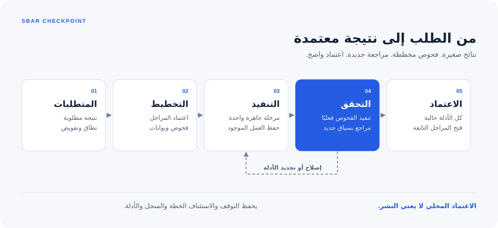
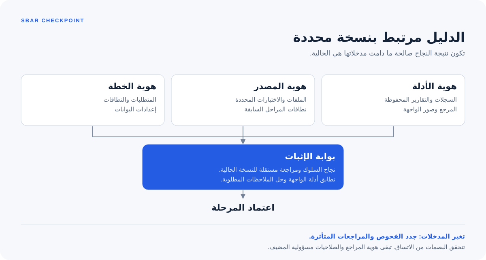

<div dir="rtl">

# Sbar Checkpoint

اللغة: [العربية](README.ar.md) | [English](README.md)

[](https://github.com/M7MMAD-OMAR/sbar-checkpoint/actions/workflows/verify.yml)

مهارة لـCodex وClaude Code وHermes Agent تحوّل العمل البرمجي الكبير إلى مراحل تحقق تراعي الاعتماد بينها وتستند إلى أدلة قابلة للتحقق.

قد تصبح نتيجة اختبار قديمة بعد تغيير المصدر، وقد تصف المراجعة نسخة أخرى من التنفيذ، وقد يترك توقف أمر نتيجته غير محسومة. تسجل Sbar Checkpoint الفحوص المخططة وبصمات المصدر والخطة وتقارير المراجعة المستقلة واعتماد المراحل بعضها على بعض، حتى يعرف الوكيل ما ثبت حاليًا وما يحتاج إلى فحص جديد.

استخدمها للإصلاحات التي تشمل عدة ملفات والميزات متعددة المراحل والترحيلات والتدقيق. التعديلات الصغيرة القابلة للتراجع تحتاج عادةً إلى تحقق مباشر بدل سير عمل بمراحل تحقق.



## التثبيت

للتثبيت في Codex وClaude Code وHermes Agent باستخدام Skills CLI:

<div dir="ltr">

```sh
npx skills add M7MMAD-OMAR/sbar-checkpoint --skill sbar-checkpoint -a codex claude-code hermes-agent -g
```

</div>

أو انسخ المستودع واستخدم المثبت المرفق لمضيف واحد:

<div dir="ltr">

```sh
git clone https://github.com/M7MMAD-OMAR/sbar-checkpoint.git
cd sbar-checkpoint
python3 skills/sbar-checkpoint/scripts/install.py --host codex
# Alternatives: --host claude or --host hermes
```

</div>

يرفض المثبت المرفق الوجهة الموجودة، ولا يغير الإعدادات أو يثبت hooks. مسارات المستخدم الافتراضية هي `~/.codex/skills/sbar-checkpoint` و`~/.claude/skills/sbar-checkpoint` و`~/.hermes/skills/sbar-checkpoint`. يشرح [دليل البداية](docs/getting-started.ar.md) تخصيص المجلد الجذر والتثبيت داخل مشروع.

تتوفر حزم ZIP و`.skill` القابلة للنقل في [الإصدارات](https://github.com/M7MMAD-OMAR/sbar-checkpoint/releases). يتضمن كل إصدار بصمات SHA256 للتحقق من الملفات.

يحتاج المحرك Python 3.10 أو أحدث على POSIX، ولا يعتمد على حزم Python خارجية. تحتاج Node.js فقط إذا اخترت طريقة التثبيت الاختيارية بـ`npx`. يظل إعداد المصادقة والأدوات مسؤولية المضيف.

## الاستخدام

استدعِ `$sbar-checkpoint` في Codex أو `/sbar-checkpoint` في Claude Code وHermes التفاعلي. اذكر النتيجة المطلوبة والقيود والتفويض. المثال التالي قالب طلب بالإنجليزية:

```text
استخدم sbar-checkpoint لإصلاح تكرار تنفيذ الطلب في هذا المستودع.
حافظ على الواجهة العامة والتعديلات غير الملتزم بها. أعد إنتاج المشكلة أولًا،
ثم نفذ الإصلاح في بيئة اختبار محلية معزولة. اختبر إعادة المحاولة والتزامن
وحدود المؤسسات. أنت مفوض بتعديل المصدر والاختبارات اللازمة لهذا الإصلاح.
اطلب مراجعة مستقلة في سياق جديد. لا تنشر. سلّم السلوك المنفذ والأدلة الحالية
وأي حدود لم تسمح البيئة بالتحقق منها.
```

في Hermes غير التفاعلي، حمّل المهارة صراحةً. تمرير الأمر الذي يبدأ بشرطة مائلة كنص استعلام عادي ليس بديلًا موثوقًا:

<div dir="ltr">

```sh
hermes chat --oneshot --skills sbar-checkpoint --query-file prompt.txt
```

</div>

تقرأ المهارة قواعد المشروع، وتخطط تغطية المتطلبات والبوابات، وتنفذ مرحلة جاهزة واحدة، وتشغّل فحوصها، وتحصل على مراجعة مستقلة، ثم تعتمد النتيجة وفق سياسة الموافقة القائمة. تحفظ التشغيل لإيقافه مؤقتًا واستئنافه.

راجع [دليل البداية الكامل](docs/getting-started.ar.md) لتجربة المحرك محليًا وأمثلة كاملة للإصلاح والتدقيق للقراءة فقط والترحيل والواجهة والإيقاف المؤقت والاستئناف. يقدم [دليل الاستخدام العربي](docs/usage-ar.md) شرحًا للتثبيت والاستخدام مع قوالب طلبات بالعربية.

## ما الذي تثبته الأدلة



- تسجل أدلة السلوك الأمر المخطط ومخرجاته وعدد الاختبارات المنفذة فعليًا حيث يكون مدعومًا وهوية المصدر.
- تربط تقارير المراجعة الحكم والملاحظات بالمصدر والخطة الحاليين. يجب أن يعمل المراجع في سياق جديد مستقل.
- تربط أدلة الواجهة ملفات المرجع والالتقاط ببيانات وصفية متطابقة لبيانات الاختبار والدور والحالة واللغة وأبعاد نافذة العرض. يجب أن يفحص المضيف الصور فعليًا.
- يؤدي تغيير المصدر داخل النطاق أو ملفات الأدلة المنسوخة إلى تقادم الأدلة السابقة. تدخل نطاقات المراحل السابقة ضمن بصمات المصدر للمراحل التابعة.
- يحفظ سجل مترابط بالبصمات الانتقالات. تُعاد بناء الحالة من هذا السجل بدل الوثوق بملف حالة قابل للتعديل.

يدعم المحرك الأوضاع `feature` و`repair` و`migration` و`audit` و`plan`. يميز العمل المفوض عن القرارات التي تحتاج إلى ملاحظة موافقة. تسجل ملاحظة الموافقة تفويضًا معلنًا، لكنها لا تصادق على هوية إنسان ولا تمنح حقوق نشر.

## النطاق والحدود

هذا سير عمل محلي وأداة للتحقق من الاتساق، وليس بيئة عزل أو حدًا أمنيًا مصادقًا عليه. يمكن لوكيل يملك صلاحية كتابة كاملة تغيير المحرك أو إعادة كتابة السجل أو انتحال مراجع. أسماء المنفذين والمراجعين لا تثبت الاستقلال. استخدم تحققًا خاضعًا لجهة منفصلة وصلاحيات مقيدة عندما تحتاج إلى هذا الحد الأمني.

تظل طلبات التدقيق والتخطيط للقراءة فقط وفق عقد المهارة. لا يستطيع المحرك منع كل كتابة من أمر موثوق. يجب أن يشمل النطاق كل المصادر والاختبارات والإعدادات والعقود المؤثرة؛ الملفات المستبعدة لا تحميها البصمة.

يسجل المحرك ملفات أدلة الواجهة وبصماتها، ولا يحكم على البكسلات أو الوصولية أو المظهر. غياب أدوات المتصفح أو الصور أو المراجعة المستقلة يترك البوابة المقابلة دون إثبات.

تغطي مصفوفة CI للمحرك Python 3.10 و3.12 و3.14 على Linux، وPython 3.12 على macOS. راجع سير العمل المرتبط لمعرفة النتائج الحالية. Windows الأصلي غير مدعوم؛ يجب أن تتيح بيئة POSIX مثل WSL للمضيف والمحرك الوصول إلى نظام الملفات نفسه. التثبيت على محطة عمل لا يثبت التنفيذ على مضيف سحابي أو صحة سلوك مزود إنتاج.

يوقف الإيقاف المؤقت وانتهاء المهلة مجموعة عمليات الفحص المملوكة للتشغيل. قد تتجاوزها الجلسات المفصولة عمدًا. تمنع رموز الاستدعاء إعادة تشغيل فحص مكتمل، لكنها لا توفر ضمان عدم تكرار العملية على مستوى التطبيق للمدفوعات أو الكتابات الخارجية.

## المراجع والتطوير

- [التحقق وتجارب الوكلاء](docs/validation.ar.md)

- [تعليمات المهارة، بالإنجليزية](skills/sbar-checkpoint/SKILL.md)
- [مرجع أوامر المحرك وصيغ البيانات، بالعربية](skills/sbar-checkpoint/references/cli.ar.md)
- [مرجع أوامر المحرك وصيغ البيانات، بالإنجليزية](skills/sbar-checkpoint/references/cli.md)
- [مسارات المضيفين وقابلية النقل، بالإنجليزية](skills/sbar-checkpoint/references/hosts.md)
- [البوابات، بالإنجليزية](skills/sbar-checkpoint/references/gates.md) و[أدوار المراجعة، بالإنجليزية](skills/sbar-checkpoint/references/roles.md)
- [قالب خطة](skills/sbar-checkpoint/references/example-plan.json)
- [دليل المساهمة، بالعربية](CONTRIBUTING.ar.md) | [Contributing, English](CONTRIBUTING.md)

شغّل اختبارات المستودع التي تستخدم مكتبة Python القياسية من جذره:

<div dir="ltr">

```sh
python3 -B -m unittest discover -s tests -v
```

</div>

توجد حزمة المهارة في `skills/sbar-checkpoint/`، بينما تبقى الاختبارات والأدلة العامة في جذر المستودع.

مرخصة بموجب [MIT](LICENSE).

</div>
