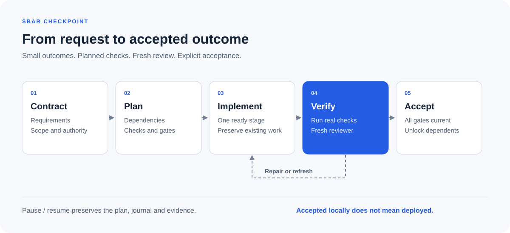
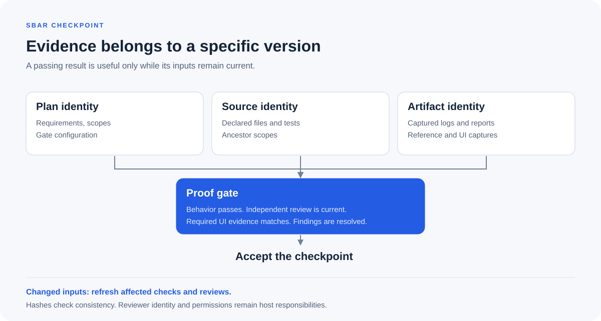

# Sbar Checkpoint

Language: [English](README.md) | [العربية](README.ar.md)

[](https://github.com/M7MMAD-OMAR/sbar-checkpoint/actions/workflows/verify.yml)

A skill for Codex, Claude Code, and Hermes Agent that turns substantial software work into dependency-aware checkpoints with verifiable evidence.

A test result can become stale after a source change. A review can describe a different version of the implementation. A stopped command can leave its outcome uncertain. Sbar Checkpoint records planned checks, source and plan hashes, independent review reports, and checkpoint dependencies so an agent can tell what is currently proven and what needs another check.

Use it for cross-file repairs, multi-stage features, migrations, and audits. Small reversible edits usually need direct verification rather than a checkpoint workflow.



## Install

For Codex, Claude Code, and Hermes Agent, using the Skills CLI:

```sh
npx skills add M7MMAD-OMAR/sbar-checkpoint --skill sbar-checkpoint -a codex claude-code hermes-agent -g
```

Or clone this repository and use the bundled installer for one host:

```sh
git clone https://github.com/M7MMAD-OMAR/sbar-checkpoint.git
cd sbar-checkpoint
python3 skills/sbar-checkpoint/scripts/install.py --host codex
# Alternatives: --host claude or --host hermes
```

The bundled installer refuses an existing destination and does not change settings or install hooks. Its default user paths are `~/.codex/skills/sbar-checkpoint`, `~/.claude/skills/sbar-checkpoint`, and `~/.hermes/skills/sbar-checkpoint`. Host root overrides and project installation are documented in [getting started](docs/getting-started.md).

Portable ZIP and `.skill` bundles are available in [Releases](https://github.com/M7MMAD-OMAR/sbar-checkpoint/releases). Each release includes SHA256 checksums.

The engine requires Python 3.10+ on POSIX and has no third-party Python dependencies. Node.js is needed only for the optional `npx` installation route. Host authentication and tools remain the host's responsibility.

## Use

Invoke `$sbar-checkpoint` in Codex or `/sbar-checkpoint` in Claude Code and interactive Hermes. Include the desired outcome, constraints, and authorization:

```text
Use sbar-checkpoint to repair the duplicate request handling in this repository.
Preserve the public API and existing uncommitted work. Work in an isolated local
test environment. Cover retries, concurrent requests, and tenant boundaries.
Use a fresh independent reviewer and finish with the checks and remaining gaps.
Do not deploy.
```

For noninteractive Hermes, preload the skill explicitly. A slash command passed as plain query text is not a reliable substitute:

```sh
hermes chat --oneshot --skills sbar-checkpoint --query-file prompt.txt
```

The skill reads project rules, plans requirement coverage and gates, implements one ready checkpoint, executes its checks, obtains independent review, and accepts the result under the existing approval policy. It preserves the run for pause and resume.

See [getting started](docs/getting-started.md) for a local engine walkthrough and complete repair, read-only audit, migration, UI, and pause/resume examples. [الدليل العربي](docs/usage-ar.md) explains installation and use in Arabic.

## What the evidence proves



- Behavior evidence records the planned command, its output, actual test counts where supported, and source identity.
- Review reports bind a verdict and findings to the current source and plan. The reviewer must work in a fresh independent context.
- UI evidence binds reference and capture artifacts to matched fixture, role, state, language, and viewport metadata. The host must inspect the images.
- Changed scoped source or copied artifacts makes earlier evidence stale. Dependency scopes are included in downstream source hashes.
- A checksum-linked journal preserves transitions. Status is reconstructed from that journal, rather than trusted from an editable status file.

The engine supports `feature`, `repair`, `migration`, `audit`, and `plan` modes. It distinguishes delegated work from decisions requiring an approval note. An approval note records asserted authorization; it does not authenticate a human or grant deployment rights.

## Scope and limits

This is a local workflow and consistency checker, not a sandbox or an authenticated security boundary. A full-write agent can alter the engine, rewrite the journal, or impersonate a reviewer. Actor labels do not prove independence. Use separately controlled verification and restricted permissions where that boundary matters.

Audit and plan requests remain read-only under the skill contract. The engine cannot stop arbitrary writes from a trusted command. Scope must include all influential source, tests, configuration, and contracts; omitted files are not protected by a hash.

The engine records and hashes UI artifacts. It does not judge pixels, accessibility, or appearance. Missing browser, image, or independent review tools leave the corresponding gate unproven.

The engine CI matrix covers Python 3.10, 3.12 and 3.14 on Linux, and Python 3.12 on macOS. Check the linked workflow for current results. Native Windows is unsupported; a POSIX environment such as WSL must keep the host and engine on the same filesystem. Workstation installation does not establish cloud-host execution or production-provider correctness.

Pause and timeout stop the owned check's process group. Deliberately detached sessions can escape it. Invocation tokens avoid replaying a completed check; they do not provide application-level idempotency for payments or external writes.

## Reference and development

- [Verification and host trials](docs/validation.md)

- [Skill instructions](skills/sbar-checkpoint/SKILL.md)
- [Engine CLI and schemas](skills/sbar-checkpoint/references/cli.md)
- [Host paths and portability](skills/sbar-checkpoint/references/hosts.md)
- [Gates](skills/sbar-checkpoint/references/gates.md) and [review roles](skills/sbar-checkpoint/references/roles.md)
- [Example plan](skills/sbar-checkpoint/references/example-plan.json)

Run the repository's standard-library tests from its root:

```sh
python3 -B -m unittest discover -s tests -v
```

The skill bundle lives in `skills/sbar-checkpoint/`; tests and public guides stay at the repository root.

Licensed under [MIT](LICENSE).
